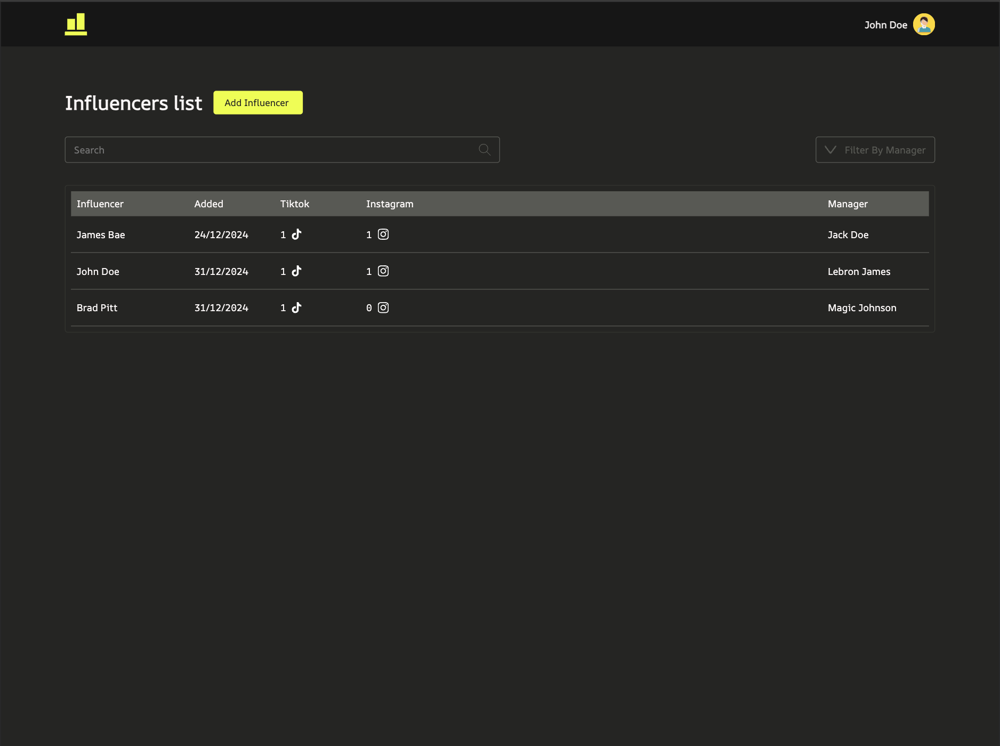
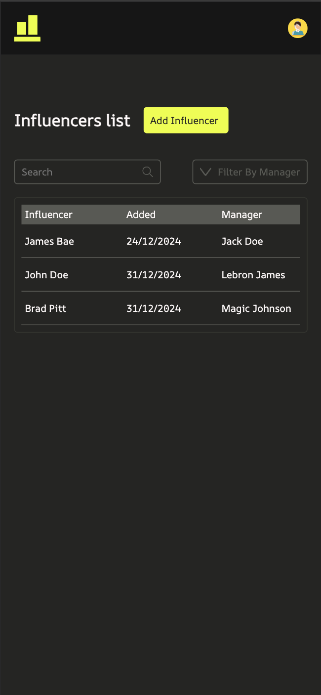
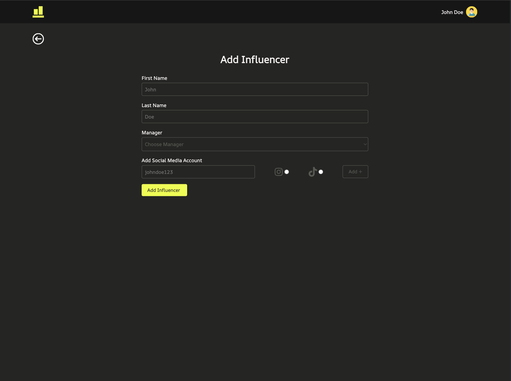
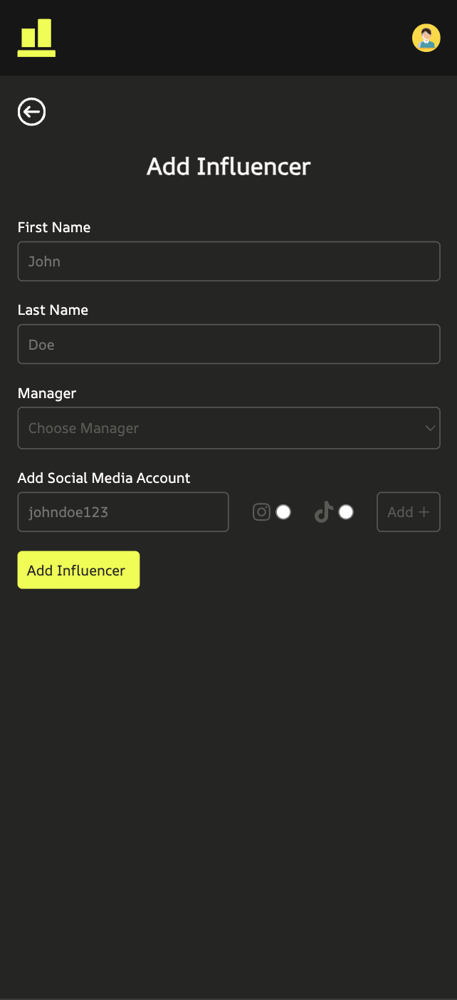
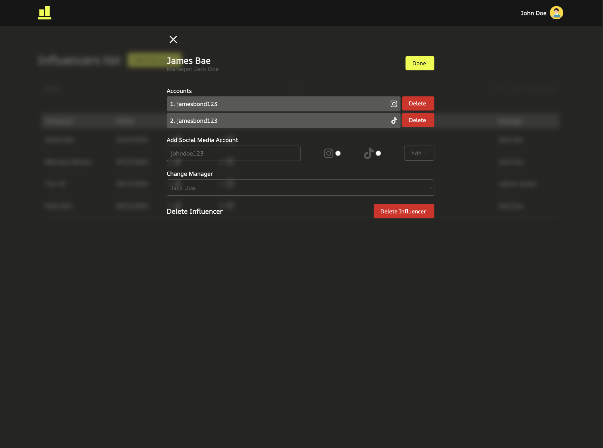
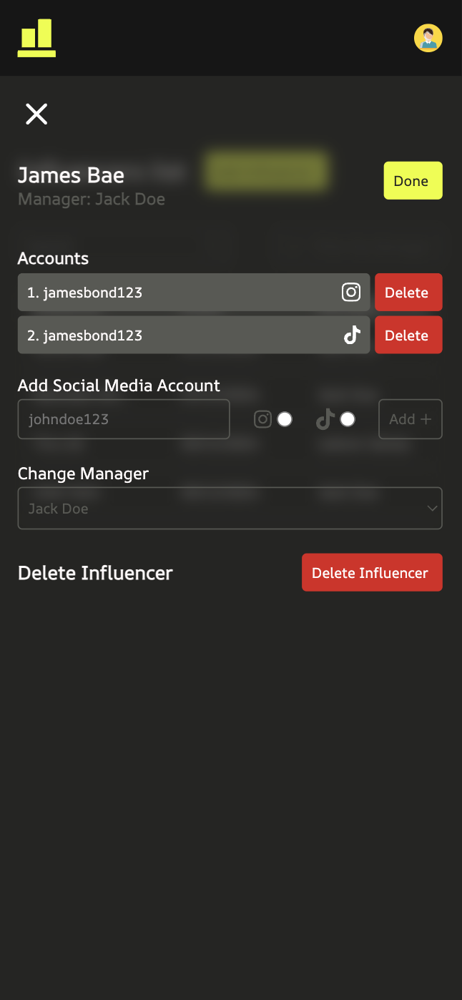

# Influencer Management System

Welcome to the Influencer Management System! 🎉 This is a full-stack web application built for managing influencers, their social media accounts, and assigning them to managers.

## Features
- Add, update, delete influencers and their social media accounts.
- Assign managers to influencers.
- Search influencers by name or filter by manager.
- Edit influencer details and dynamically add/remove social media accounts.
- A responsive UI built with React and TypeScript.
- Backend with Node.js, Express, and Prisma connected to a MongoDB database.

---

## Project Structure

```plaintext
InfluencerManagementSystem/
│
├── api/                 # Backend code
│   ├── prisma/          # Prisma schema file
│   ├── src/             
│   │   ├── controllers/ # API controllers
│   │   ├── routes/      # API routes
│   │   ├── lib/         # Database connection (Prisma client)
│   │   ├── index.ts     # Entry point for the backend
│   │   └── .env         # Backend environment variables
│   └── package.json     # Backend dependencies
│
├── client/
│   ├── public/          # Images and assets
│   ├── src/             
│   │   ├── components/  # Reusable components (e.g., Button, ListRow)
│   │   ├── fonts/       # Project fonts
│   │   ├── routes/      # Pages (e.g., ListPage, AddInfluencerPage)
│   │   ├── styles/      # Global style files
│   │   ├── types/       # TypeScript types
│   │   ├── utils/       # Utility files (e.g., Axios instance)
│   │   └── .env         # Frontend environment variables
│   └── package.json     # Frontend dependencies
│
├── docs/                # Docs for API and Figma design
│    ├── API_Documentation.md
│    └── Figma_Design.md
│
├── screenshots/         # Screenshots of the project
│
│
└── README.md            # Project overview
```
## Technologies Used

### Frontend
- React with TypeScript
- Vite for fast development
- SCSS for styling
- Axios for API calls
- Vercel for deployment

### Backend
- Node.js with TypeScript
- Express for API routing
- Prisma as an ORM
- MongoDB for the database
- dotenv for environment variable management
- Render for deployment

---

## Setup Guide

### 1. Clone the Repository
```bash
git clone https://github.com/mjarviste/InfluencerManagementSystem.git
cd InfluencerManagementSystem
```
### 2.Set Up MongoDB:
1. Go to MongoDB Atlas and create a free cluster.
2. Create a database named influencer-management-system (or your preferred name).
3. Add a user with access credentials.
4. Whitelist your IP address or allow access from anywhere (0.0.0.0/0) for testing purposes.

### 3. Backend Setup
- Navigate to the `api` directory:
```bash
cd api
```
- Install dependencies:
```bash
npm install
```
- Create .env file:
```bash
touch .env
```
- Set up the .env files:
```bash
DATABASE_URL=mongodb+srv://<username>:<password>@<cluster-name>.mongodb.net/<database-name>?retryWrites=true&w=majority
CLIENT_URL=http://localhost:5173
NODE_ENV=dev
```
Replace ```<username>```, ```<password>```, ```<cluster-name>```, and ```<database-name>``` with your MongoDB details.
- Run the Prisma migration:
```bash
npx prisma db push
```
- Start the backend:
```bash
npm run dev
```
The backend will be running at http://localhost:3000.

### 4. Frontend Setup
- Navigate to the `client` directory:
```bash
cd client
```
- Install dependencies:
```bash
npm install
```
- Create .env file:
```bash
touch .env
```
- Set up the .env file:
```bash
VITE_API_URL=http://localhost:3000
```
- Start the frontend development server:
```bash
npm run dev
```
The frontend will be running at http://localhost:5173.

### 5. Add Managers

To add a new manager to the system, you can use the following API endpoint.
- Endpoint: **POST** `/api/managers`
- Request Example:
You can add a manager named "John Doe" with no influencers using the following cURL command:
```bash
curl -X POST http://localhost:3000/api/managers \
-H "Content-Type: application/json" \
-d '{
  "firstName": "John",
  "lastName": "Doe",
  "influencers": []
}'
```

## Deployment

### Frontend
- Deployed using Vercel. Make sure to set the `VITE_API_URL` environment variable to your backend's production URL.

### Backend
- Deployed using Render. Set the following environment variables:
  - `DATABASE_URL`: Your MongoDB connection string.
  - `CLIENT_URL`: Your frontend's production URL.
  - `NODE_ENV`: Make sure that it is set to `production`.

---

## Future Improvements
- Add pagination for large datasets.
- Implement authentication for secure access.
- Improve error handling and validation.

## Documentation
- [API Documentation](docs/API_Documentation.md)

## Design
- [Figma Design](docs/Figma_Design.md)

## Screenshots from the 
1. **Influencers List Page**
   
   
   
2. **Add Influencer Page**
   
   

3. **Add Influencer Page**
   
   

## Live Demo
- [Live App](https://influencer-frontend-two.vercel.app/)